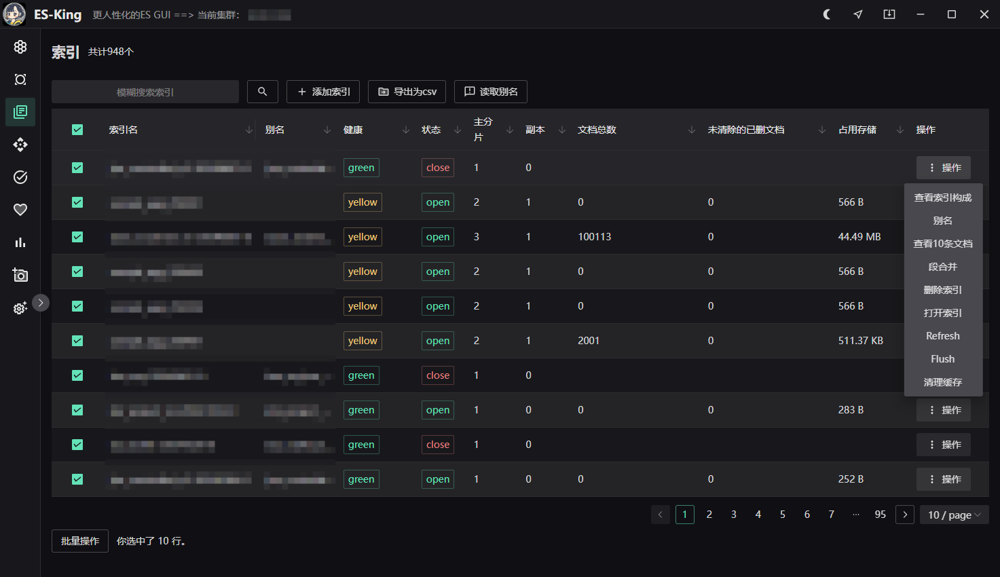

<h1 align="center">ES-King </h1>
<h4 align="center"><strong>简体中文</strong> | <a href="https://github.com/Bronya0/ES-King/blob/main/readme-en.md">English</a></h4>

<div align="center">


<strong>A modern, practical, lightweight ES GUI client that supports multiple platforms and the installation package is less than 10mb. </strong>

</div>

The same Kafka client has been developed and has been downloaded by more than a thousand people: [Kafka-King](https:// github.com/Bronya0/Kafka-King)

If you need to raise requirements, bugs and improvement suggestions, please raise an issue.

Click a star to support the author's hard work in open source. Thank you❤❤

Join the group and communicate with the author: <a target="_blank" href="https://qm.qq.com/cgi-bin/qm/qr?k=pDqlVFyLMYEEw8DPJlRSBN27lF8qHV2v&jump_from= webapi&authKey=Wle/K0ARM1YQWlpn6vvfiZuMedy2tT9BI73mUvXVvCuktvi0fNfmNR19Jhyrf2Nz">R&D technical exchange group: 964440643</a>

# Function list
- Detailed cluster information: node information, heap memory usage, total memory usage, cpu usage, disk usage, network traffic, node role, cluster Health, 5-minute load, field cache per node, segment cache, query cache, request cache, total number of segments metrics
- Metrics: total number of active shards, number of shards being initialized, number of delayed unallocated shards (possibly because allocation strategy waiting conditions are not met), percentage of active shards (possibly frozen, closed, faulty, etc.)
- Index index, document index, memory index, node index, storage index, segment index...
- Support cluster viewing- Support index search, management, and export csv
- Support index operations: index management, sample viewing of 10 document contents, index alias, View index settings, refresh index, merge index segments, delete index, close or open index, flush index, clean index cache...
- Comes with rest window (of course you can use postman if you like)

# Download
[Download address](https ://github.com/Bronya0/ES-King/releases), click [Assets], and choose the platform of your office computer to download. It supports Windows, MacOS, and Linux.

# Screenshot


 

# Build 
is only needed to study the source code.
Install wails, refer to: https://wails.io/docs/gettingstarted/installation

```
cd app
wails dev
```

# Star
[](https://starchart.cc/Bronya0/ES-King)

# Thanks
- wails: https://wails.io/docs/gettingstarted/installation
- naive ui : https://www.naiveui.com/