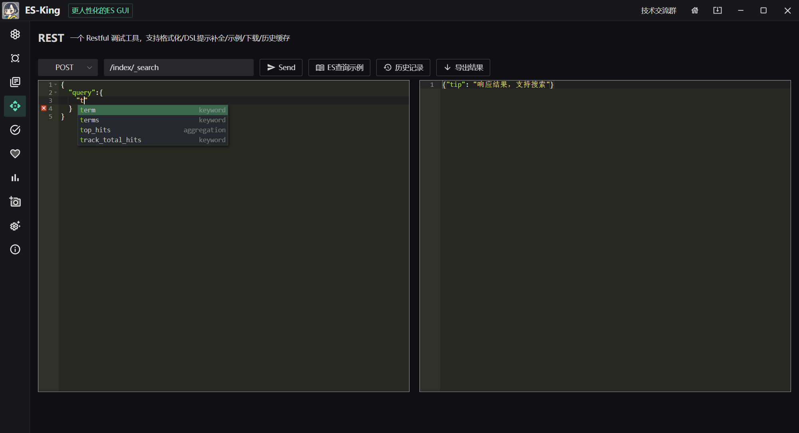

<p align="center">
  
</p>
<h1 align="center">ES-King </h1>
<h4 align="center"><strong>简体中文</strong> | <a href="https://github.com/Bronya0/ES-King/blob/wails/readme-en.md">English</a></h4>

<div align="center">


<strong>一个现代、实用、轻量的ES GUI客户端，支持多平台，安装包不到10mb。</strong>


</div>

让ES更好用，make es great again!


如需提出需求、bug和改进建议，请提issue。

点个star支持作者辛苦开源吧 谢谢❤❤

加群和作者一起交流： <a target="_blank" href="https://qm.qq.com/cgi-bin/qm/qr?k=pDqlVFyLMYEEw8DPJlRSBN27lF8qHV2v&jump_from=webapi&authKey=Wle/K0ARM1YQWlpn6vvfiZuMedy2tT9BI73mUvXVvCuktvi0fNfmNR19Jhyrf2Nz">研发技术交流群：964440643</a>

**同款已经开发好的Kafka客户端，已有数千人下载**：[Kafka-King](https://github.com/Bronya0/Kafka-King)

# 功能清单
- 详尽的集群信息：节点信息、堆内存占用、总内存占用、cpu占用、磁盘占用、网络流量、节点角色、集群健康、5分钟负载、每个节点的字段缓存、段缓存、查询缓存、请求缓存、段总数指标
- 指标查看：活跃的分片总数、初始化中的分片数量、延迟未分配的分片数量量（可能因为分配策略等待条件未满足）、活跃分片占比 (可能冻结、关闭、故障等)
- 索引指标、文档指标、内存指标、节点指标、存储指标、段指标……
- 支持集群查看
- 支持索引搜索、管理，导出csv
- 支持索引操作：索引管理、抽样查看10条文档内容、索引别名、索引设置查看、索引刷新、索引段合并、删除索引、关闭or打开索引、flush索引、清理索引缓存……
- 自带rest窗口（当然你喜欢也可以自己用postman）

# 下载
[下载地址](https://github.com/Bronya0/ES-King/releases)，点击【Assets】，选择自己办公电脑的平台下载，支持windows、macos、linux。


# 截图




# 捐赠
有条件可以请作者喝杯咖啡，支持项目发展，感谢💕


# 构建
只有要研究源码才需要。
安装wails，参考：https://wails.io/docs/gettingstarted/installation
```
cd app 
wails dev
```

# 星
[](https://starchart.cc/Bronya0/ES-King)


# 感谢
- wails：https://wails.io/docs/gettingstarted/installation
- naive ui：https://www.naiveui.com/
